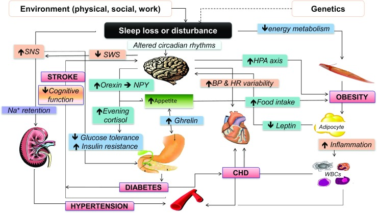
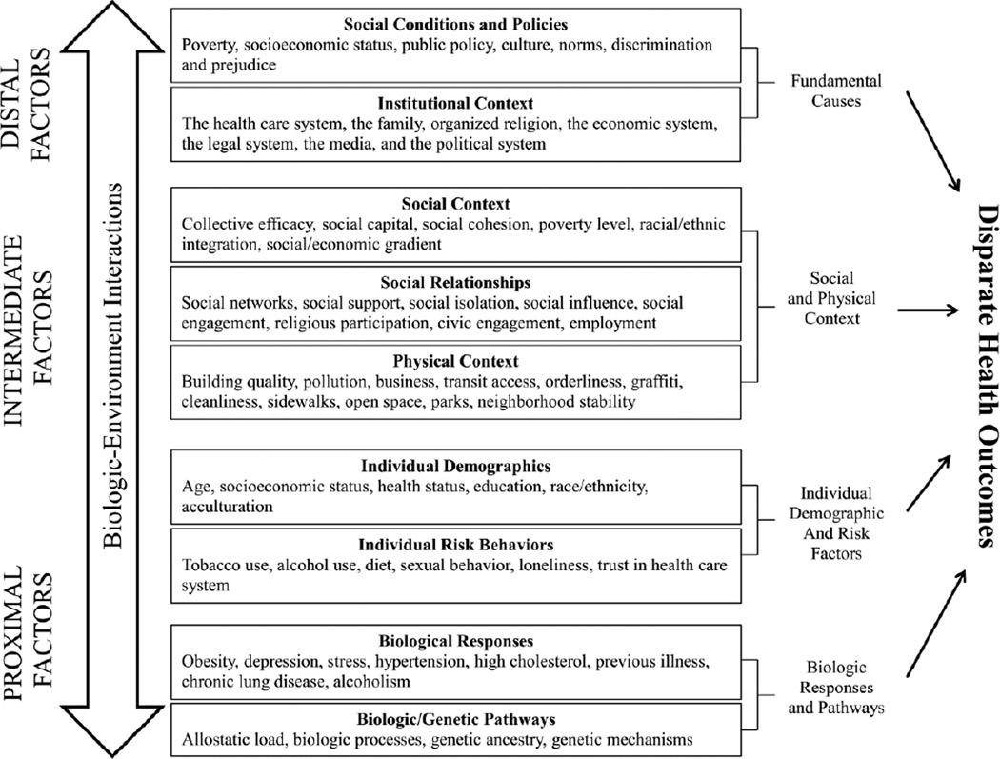

## Did you sleep well?

### Sleeping problems are common.
Adults should sleep 7 or more hours per night on a regular basis to promote optimal health. However, more than one-third of the US population gets less than the recommended amount of sleep (https://aasm.org/seven-or-more-hours-of-sleep-per-night-a-health-necessity-for-adults/). 

### Sleep & Individual Health

Not getting enough sleep is linked with chronic diseases and adverse health conditions, threateniing the nation’s overall public health. Short sleep duration along with other dimensions of poor sleep has been associated with weight gain and obesity, type 2 diabetes,  increased risk of hypertension, cardiovascular disease and depression. Sleep deprivation and disorders are also associated with impaired immune function, chronic pain, impaired performance, increased errors, and greater risk of accidents.

### Sleep & Public Health

Intuitively, we tend to believe that sleep is only related to individual habits like caffeine intake or regular exercise. However, numerous studies have revealed that sleep is a central problem of public health, pointing out that differences in quantity or quality of sleep are related to a variety of biological, economic and social factors. It was reported in a CDC survey (https://www.cdc.gov/mmwr/preview/mmwrhtml/mm6412a10.htm) that 35.2% of people with incomes below the poverty line reported getting less than 6 hours of sleep per day, compared with the proportion of 27.7% among those with incomes more than four times the poverty line. The disparities between racial groups are even sharper. A rigorous 2015 study found that compared with whites matched for age and sex, Blacks were 5 times as likely to sleep for shorter periods. Hispanics and Chinese Americans were roughly 2 times as likely to get fewer hours of sleep than whites. Furthermore, sleep deprivation and disorders could further lead to health problems, poor academic and work performances, which deepen inequalities among populations in the long run. 

### Our motivation
Sleep is a necessary physiological process for individuals, interacting with several economic, social and physical factors, influencing risks of multiple health problems. Therefore, based on NHANES dataset, we focus on sleep-related public health issues to carry out our research, hoping to popularize the significance of adequate and healthy sleep, arousing the public's health awareness of improving sleep quality and obtaining adequate sleep duration. We also want to visualize and discuss the biological, economic and social factors interacting with sleep, informing the public and healthcare providers on the importance of advocating public policy to promoting the nowadays sleep situation and overall public health.